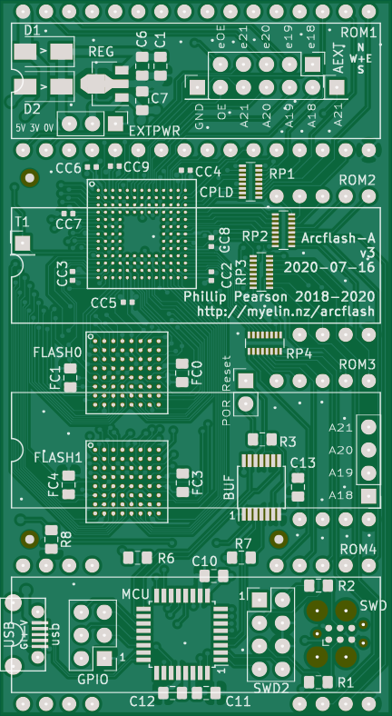

# Arcflash Design Overview

Arcflash is a circuit board that plugs into the ROM sockets of many of the "Archimedes" series computers made by Acorn in the UK, circa 1990, running ARM2 or ARM3 processors (ARMv2 arch).
It allows uploading one or more operating system images over USB, and includes a bootloader to allow the user to select one to boot.

## Circuit design ([pcb/](pcb/))

The OS images are stored on two 16 bit wide 8MB flash chips; `FLASH0` holds the lower two bytes of each word and `FLASH1` holds the high bytes.

A CPLD (`CPLD`) handles all the switching; it connects to the ROM socket address and data lines (via resistor packs RP1-4) and passes addresses through to the flash chips and data back to the data lines on the ROM sockets.

A microcontroller (`MCU`) provides the USB interface, so an attached computer can program OS images into the flash chips.

## CPLD gateware ([cpld/](cpld/))

The CPLD gateware's main function is to proxy the host's address bus (as seen on the ROM socket pins) over to the flash chips, and proxy data back to the host.

It also speaks a simple SPI protocol to allow the MCU to read and write from the flash, select the flash bank to expose to the host machine, and 

Finally, it listens for reads to certain "magic addresses", and implements a one-bit communication channel between the host and MCU. With proper timing, the host can bit-bang a slow serial connection.

The CPLD gateware is built using the (discontinued) Xilinx ISE 14.7 software.

## Host bootloader ([os_switcher_bootloader/](os_switcher_bootloader/))

The host bootloader runs as a bare-metal application.

It reads a proto containing information about all the OS images programmed into the flash, displays a menu, and forwards the user's OS selection to the microcontroller (over the bit-banged serial port).

See [this forum post](https://stardot.org.uk/forums/viewtopic.php?p=229976#p229976) for details on the code structure.

The host bootloader is compiled with gcc-arm-none-eabi version 8 or earlier (GCC 9 dropped ARMv2 support).

## MCU firmware ([firmware/](firmware/), [bootloader/](bootloader/))

The MCU firmware is mainly responsible for USB communication: it speaks a very simple text-based protocol that allows the remote driver software to program the flash.

It is also responsible for listening on a serial port for instructions from the host bootloader. When the user selects an OS to boot, the MCU firmware sends instructions to the CPLD to switch banks, then drives the system reset line to cause the host machine to reboot.

The MCU firmware is compiled compiled using the Arduino toolchain (using `arduino-cli`).

## Remote driver software ([python_lib/](python_lib/))

This code runs on an attached computer, to pack OS images into the correct format, and send them to an Arcflash board over USB.

The remote driver software is written in Python 3.
